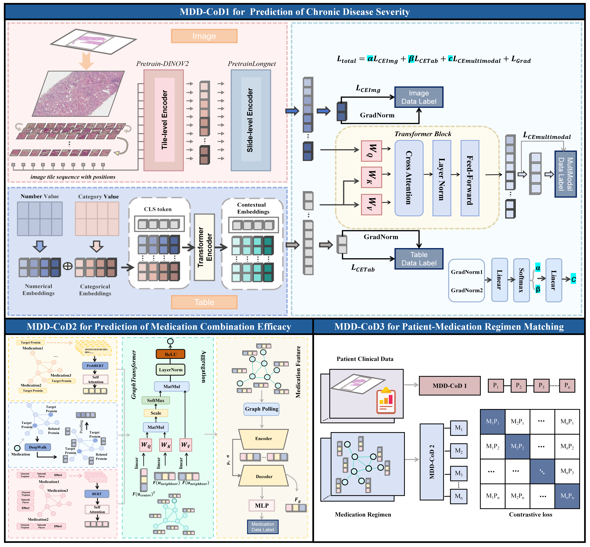

# MDD-CoD: Personalized Medication for Chronic Diseases via a Multimodal Data-Driven Chain-of-Decisions
<div style="width: 100%; overflow: hidden; margin: 20px 0;">
  <div style="width: 49%; float: left; text-align: center;">
    
    <p style="margin-top: 10px; font-weight: bold;">Figure 1. MDD-CoD Method Flowchart</p>
  </div>
  

  <div style="clear: both;"></div>
</div>


# MDD-CoD1 Dataset Preparation

Please organize the dataset with the following structure:
```angular2
├── ${data_root}
│ ├── ${data_dir_patient}
│ │ ├── visual_embeddings
│ │ │ ├── 1001.npy
│ │ │ ├── 1002.npy
│ │ │ ├── ...
│ │ ├── .xlsx
```


Prepare multimodal data for each disease, including both image and tabular modalities:

- **Image modality**: Pre-extract image features and save each as a `.npy` file named by patient ID.
- **Tabular modality**: Store structured patient information in an `.xlsx` file with the following format:

| **Patient ID** | **i_Label** | **s_Label** | **all_label** | **Field1** | **Field2** | ... | **FieldN** |
|----------------|-------------|-------------|----------------|------------|------------|-----|------------|
| 1001           | 1           | 0           | 1              | value1     | value2     | ... | valueN     |
| 1002           | 0           | 1           | 1              | value3     | value4     | ... | valueN     |
| ...            | ...         | ...         | ...            | ...        | ...        | ... | ...        |
                   


# MDD-CoD2 Dataset Preparation

```angular2
├── ${data_root}
│ ├── ${data_dir_drug}
│ │ ├── Properties.xlsx
│ │ ├── Protein-Seq.xlsx
│ │ ├── PPI.xlsx
│ │ ├── PKEdge.xlsx

```

## Properties Table

| **Drug**           | **Taste & Properties**   | **Meridian**         | **Effects**                                         | **Side Effects**                                   |
|--------------------|--------------------------|----------------------|----------------------------------------------------|----------------------------------------------------|
| Elamod Tablets     | -                        | -                    | -                                                  | Common: Nausea, fatigue, headache, dizziness...   |
| Lily               | Sweet, Cold              | Heart, Lung          | Nourish Yin, Moisturize Lung, Calm the Heart...     | -                                                  |
| Processed Licorice | Sweet, Neutral           | Heart, Lung, Spleen, Stomach | Tonify Spleen, Strengthen Qi...                    | -                                                  |
| Rehmannia          | Sweet, Slightly Warm     | Liver, Kidney        | Nourish Yin, Tonify Blood, Improve Essence...       | -                                                  |

## Protein-Seq Table

| **ID**      | **Gene Symbol**          | **Protein Name**                        | **Herb**   | **Amino Acid Sequence**                                                                                               |
|-------------|--------------------------|-----------------------------------------|------------|------------------------------------------------------------------------------------------------------------------------|
| P11926      | T02WMA                   | Ornithine decarboxylase                 | A. Argyi Fol.       | MNNFGNEEFDCHFLDEGFTAKDILDQKINEVSSS...                                                                                 |
| P00441      | T30D9G                   | Superoxide dismutase [Cu-Zn]           | A. Argyi Fol.       | MATKAVCVLKGDGPVQGIINFEQKESNGPVKVWG...                                                                                 |
| P17252      | T78ZF2                   | Protein kinase C alpha type            | A. Argyi Fol.       | MADVFPGNDSTASQDVANRFARKGALRQKNVHEVK...                                                                                |
| ...         | ...                      | ...                                     | ...        | ...                                                                                                                    |
| P21730      | T27LTU                   | C5a anaphylatoxin chemotactic receptor 1 | A. Herba       | MDSFNYTTPDYGHYDDKDTLDLNTPVDKTSNTLRV...                                                                                |
| Q8NER1      | T67KTV                   | Transient receptor potential cation channel subfamily V member 1 | A. Herba | MKKWSSTDLGAAADPLQKDTCPDPLDGDPNSRPP...                                                                                 |
| Q9HBA0      | T40EUL                   | Transient receptor potential cation channel subfamily V member 4 | A. Herba | MADSSEGPRAGPGEVAELPGDESGTPGGEAFPLSS...                                                                               |
| ...         | ...                      | ...                                     | ...        | ...                                                                                                                    |


## PPI Table
### 1. Download and Prepare PPI Data

- Visit [UniProt](https://www.uniprot.org) and download high-confidence human PPI (Protein–Protein Interaction) data.
- Save the file as `ppi_edges.xlsx` with the following format:

| **Protein1** | **Protein2** | **Interaction** |
|--------------|--------------|-----------------|
| P31749       | Q6UY14-3     | 1               |
| P31749       | P31749       | 1               |
| P31749       | P31751       | 1               |
| P31749       | Q86V81       | 1               |
| ...          | ...          | ...             |


### 2. Run DeepWalk

```bash
python deepwalk.py
```

### 3. Output

The script will generate:

- `single_drug_embeddings.xlsx` — an Excel file containing feature vectors for each drug.  


## PKEdge Table

To generate prior knowledge-based edge data:

- Run the following script:

```bash
python PKEdgeConstructor.py
```


# MDD-CoD3 Dataset Preparation

```angular2
├── ${data_root}
│ ├── ${patient_features}
│ │ ├── patient1.npy
│ │ ├── patient2.npy
│ │ ├── ...
│ ├── ${prescription_features}
│ │ ├── patient1_1.npy
│ │ ├── patient1_2.npy
│ │ ├── ...
│ │ ├── patient2_n.npy
│ │ ├── ...

```


# MDD-CoD  Training Guide
<div style="width: 49%; float: right; text-align: center;">
  
  <p style="margin-top: 10px; font-weight: bold;">Figure 2. MDD-CoD Model Architecture</p>
</div>
  
## Model Overview
This repository contains the code to train a MDD-CoD model in three stages. The model consists of three phases: **MDD-CoD1**, **MDD-CoD2**, and **MDD-CoD3**. Each stage involves a specific training task and produces important features that are used in the subsequent stage. Below is a step-by-step guide for training the model.

## Installation

 **Create a Conda environment**:
   ```bash
   conda create -n MDD-CoD python=3.10
   conda activate MDD-CoD
   pip install -r requirements.txt
   ```


## Run the code
1. **Stage 1 (MDD-CoD1)**: Train the model on patient features. 
```bash
python stage1.py
```
2. **Stage 2 (MDD-CoD2)**: Train the model on prescription features. 
```bash
python stage2.py
```

3. **Stage 3 (MDD-CoD3)**: Compare and compute loss between the features from Stage 1 and Stage 2.
   
```bash
python stage3.py
```

